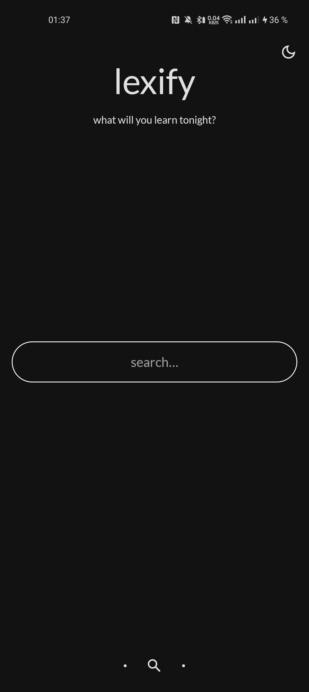
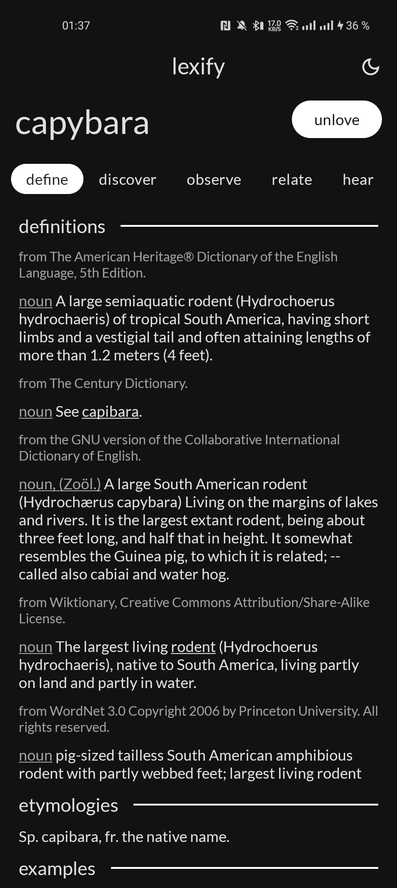
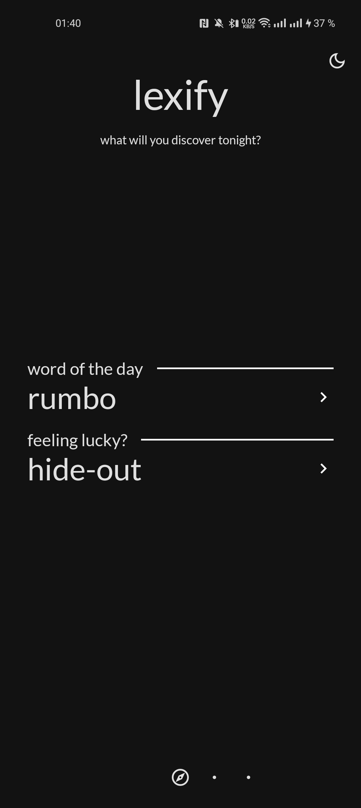
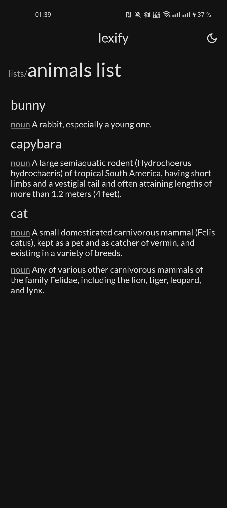
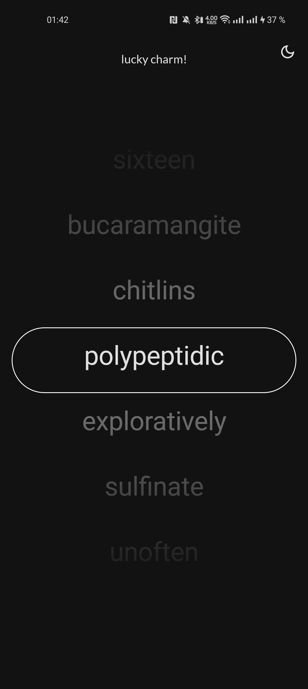

```
 /) /)
( • ༝•)  bnuuy
```

> Project for KFU ITIS × Tinkoff practice.

# lexify
Simple English dictionary app.

## Features
* Search definitions, etymology, examples, related words and pronunciation audio samples of words all from multiple dictionaries at once.
* Save your favorite words.
* Fill lists of interesting definitions.
* See Word of the Day.
* Try your luck with word randomizer.
* Night mode.

## Stack
* [Kotlin](https://kotlinlang.org/)
* [Room](https://developer.android.com/training/data-storage/room)
* [Ktor](https://ktor.io/) (w/ [Gson](https://github.com/google/gson))
* [Dagger](https://dagger.dev/)/[Hilt](https://dagger.dev/hilt/)
* [Jetpack Navigation](https://developer.android.com/guide/navigation) (w/ [safe-args](https://developer.android.com/guide/navigation/use-graph/safe-args))
* [jsoup](https://jsoup.org/)
API: [Wordnik](https://www.wordnik.com/)

## Build & Use
Building from source is pretty straightforward. To be able to use this app you'll need to get a [Wordnik](https://www.wordnik.com/) [API](https://developer.wordnik.com/) key. Create a file called `secrets.properties` in the root of project directory. It must contain the following line:
```
WORDNIK_API_KEY=<your_api_key>
```

## Screenshots
<p float="left">





</p>
